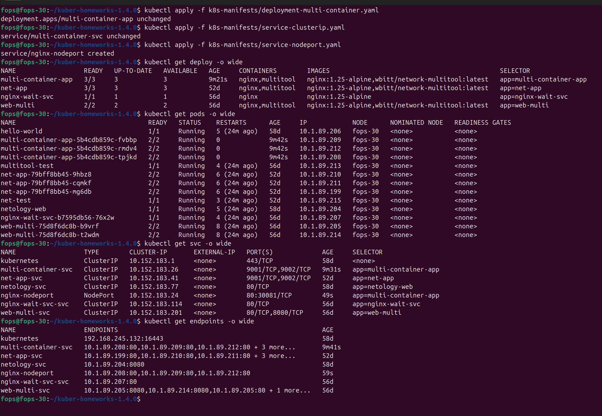
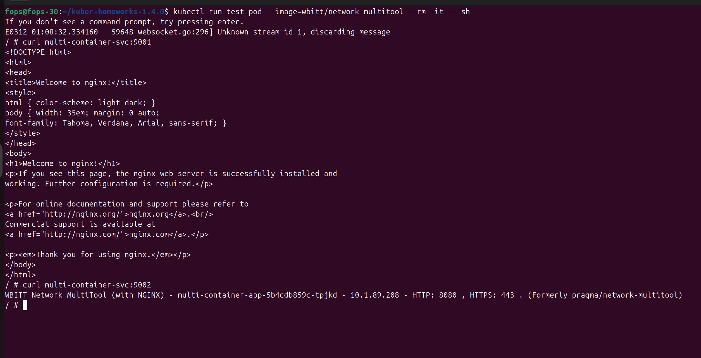
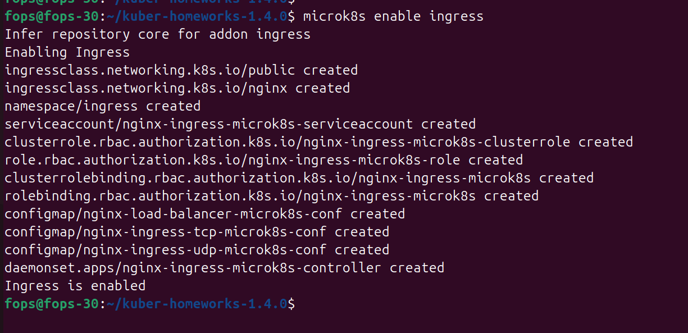
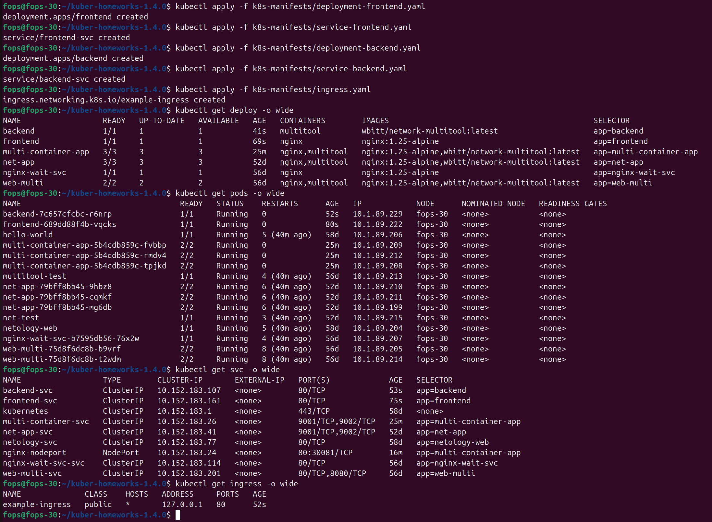
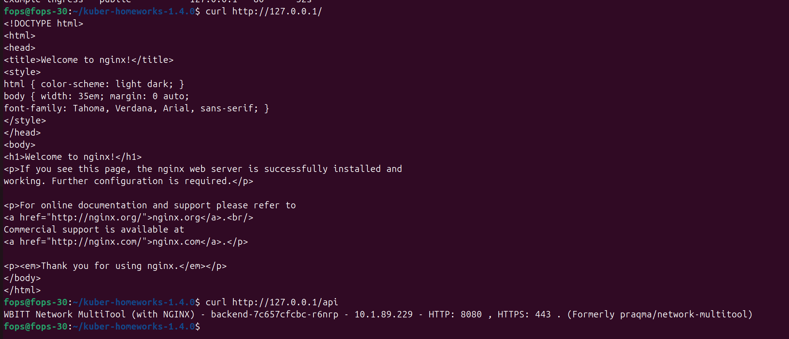

# Домашнее задание к занятию «Сетевое взаимодействие в Kubernetes»

## Цель задания
Настроить доступ к приложениям в Kubernetes:
- внутри кластера через Service (ClusterIP, NodePort);
- снаружи кластера через Ingress.

---

## Используемое окружение
- ОС: Ubuntu 24.04 (виртуальная машина)
- Kubernetes: MicroK8S
- kubectl: установлен

---

## Структура репозитория
- Манифесты лежат в каталоге `k8s-manifests/`
- Скриншоты лежат в каталоге `img/` (файлы `1.png`, `2.png`, ...)

---

## Задание 1: Service (ClusterIP и NodePort)

### Манифесты
- [k8s-manifests/deployment-multi-container.yaml](k8s-manifests/deployment-multi-container.yaml)
- [k8s-manifests/service-clusterip.yaml](k8s-manifests/service-clusterip.yaml)
- [k8s-manifests/service-nodeport.yaml](k8s-manifests/service-nodeport.yaml)

### 1.1 Применение манифестов
```bash
kubectl apply -f k8s-manifests/deployment-multi-container.yaml
kubectl apply -f k8s-manifests/service-clusterip.yaml
kubectl apply -f k8s-manifests/service-nodeport.yaml
```

### 1.2 Проверка реплик и сервисов
```bash
kubectl get deploy -o wide
kubectl get pods -o wide
kubectl get svc -o wide
kubectl get endpoints -o wide
```

Скриншот вывода команд (видно 3 реплики, ClusterIP и NodePort сервисы):



### 1.3 Проверка доступа изнутри кластера (ClusterIP)
Временный тестовый Pod (как в задании):
```bash
kubectl run test-pod --image=wbitt/network-multitool --rm -it -- sh
```

Внутри `test-pod`:
```sh
curl multi-container-svc:9001
curl multi-container-svc:9002
```

Скриншот проверки доступа изнутри кластера (curl на 9001 и 9002):



### 1.4 Проверка доступа снаружи кластера (NodePort)
На локальном компьютере/в ВМ (в зависимости от конфигурации):
```bash
curl http://192.168.245.132:30081
```

Скриншот проверки NodePort (curl или браузер):


---

## Задание 2: Ingress

### Манифесты
- [k8s-manifests/deployment-frontend.yaml](k8s-manifests/deployment-frontend.yaml)
- [k8s-manifests/service-frontend.yaml](k8s-manifests/service-frontend.yaml)
- [k8s-manifests/deployment-backend.yaml](k8s-manifests/deployment-backend.yaml)
- [k8s-manifests/service-backend.yaml](k8s-manifests/service-backend.yaml)
- [k8s-manifests/ingress.yaml](k8s-manifests/ingress.yaml)

### 2.1 Включение ingress-контроллера (MicroK8S)
```bash
microk8s enable ingress
```

Скриншот статуса аддона/подов ingress (по желанию, но полезно):



### 2.2 Развертывание frontend/backend и сервисов
```bash
kubectl apply -f k8s-manifests/deployment-frontend.yaml
kubectl apply -f k8s-manifests/service-frontend.yaml
kubectl apply -f k8s-manifests/deployment-backend.yaml
kubectl apply -f k8s-manifests/service-backend.yaml
kubectl apply -f k8s-manifests/ingress.yaml
```

Проверка объектов:
```bash
kubectl get deploy -o wide
kubectl get pods -o wide
kubectl get svc -o wide
kubectl get ingress -o wide
```

Скриншот вывода команд (видно ingress и сервисы):



### 2.3 Проверка доступа через Ingress
Проверка (curl или браузер):
```bash
curl http://<host>/
curl http://<host>/api
```

Скриншот проверки доступа через Ingress (оба запроса):



---

## Вывод
- Настроен доступ к приложению (nginx + multitool) внутри кластера через ClusterIP по разным портам (9001/9002).
- Настроен доступ к nginx снаружи кластера через NodePort.
- Развернуты frontend и backend и настроена маршрутизация через Ingress по путям `/` и `/api`.

